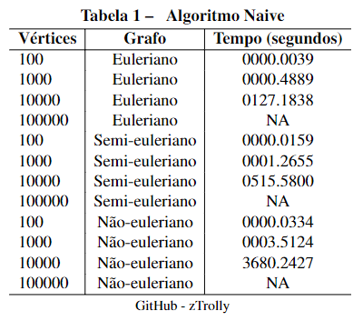
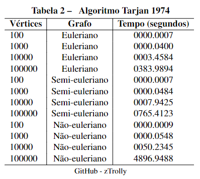

<h1> Trabalho Grafos </h1>

> **Status do Projeto:** Em desenvolvimento ⚠️

> **Documentação:** [LaTeX](https://www.overleaf.com/2134921852dhsmmwyjjjqv)

O intuito desse trabalho prático é criar dois métodos para indentificação de pontes. Pontes são arestas cuja a remoção torna o grafo desconexo. Dentre as aplicações de indentificações de pontes está encontrar os caminhos ou ciclos eurelianos em diferentes grafos, sendo os métodos de identificação de pontes e suas respectivos diretórios:
- [Método Naive](https://github.com/zTrolly/trabalho-grafos/blob/main/BridgeIdentification/naive.py)
- [Método de Tarjan (1974)](https://github.com/zTrolly/trabalho-grafos/blob/main/BridgeIdentification/tarjan_1974.py)

Além dos métodos descritos acima a implementação deverá encontrar um caminho euleriano em um grafo qualquer ou determinar que ele não existe utilizando o seguinte método:
- [Método de Fleury](https://github.com/zTrolly/trabalho-grafos/blob/main/BridgeIdentification/EulerianPath/eulerian_path.py)

Alguns experimentos devem ser realizados em apenas uma máquina para avaliar o tempo gasto para as duas estrátegias de identificação de pontes em grafos aleatórios, sendo os grafos eulerianos, semi-eulerianos e não eulerianos contendo 100, 1000, 10000, 100000 vértices para cada tipo de grafo.
- [Código Python - Criação grafos aleatórios](https://github.com/zTrolly/trabalho-grafos/blob/main/RandomGraphs/random_graph.py)
- [Agoritmo e explicação de cada grafo](https://github.com/zTrolly/trabalho-grafos/blob/main/RandomGraphs/README.md)

--------------------

 <strong> Resultado avaliação - tempo médio: </strong> 

Todos os experimentos foram realizados em uma máquina: 
- Processador i7-11390H - 3.4GHz - 2918Mhz - 4 núcleos 
- Memória - 16GB - DDR4 - 3200MHz
- Windows 11
- SSD 500GB

Vale ressaltar que os tempos estão mostrando o tempo médio de descoberta de pontes em vários grafos aleatórios.

 <strong> Método Naive: </strong> 

  

 <strong> Método Tarjan: </strong> 

  

--------------------

 <strong> Organização de diretórios: </strong> 

- `Application:` esse diretório é onde contém o código fonte da aplicação, chamada de todos os métodos para a execução, mostrando o resultado para o usuário.
- `RandomGraphs:` possui o código feito para criação de grafos de N quantidade de vértices dos tipos euleriano, semi-euleriano e não euleriano.
- `BridgeIdentification:` implementação dos métodos Naive e Tarjan.
  - `EulerianPath:` implementação do algoritmo de busca de um caminho euleriano no grafo criado.
