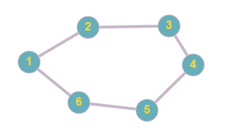
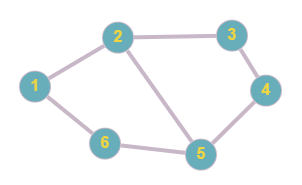
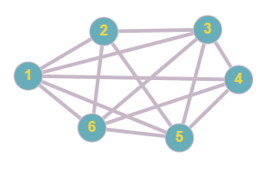

<h1> Criação dos grafos aleatórios: </h1>

Para a criação dos grafos aleatórios foram utilizadas as seguintes técnicas:
- `Eureliano:` o grafo eureliano é aquele que contém todos seus vértices com o grau par, ou seja, para ter um grafo com todos os vértices com grau par basta adicionar as arestas seguindo um padrão, sendo ele: o vértice atual adicionado ao (vértice atual + 1) fazedo com que o vértice ligue com o preecessor e sucessor, tendo grau dois, porém quando chega no útltimo vértice ele não possui sucessor, fazendo com que ele ligue no primeiro vértice criando assim um ciclo.
- `Semi-eureliano:` o grafo semi-eureliano é aquele que tem somente dois vértices com grau ímpar, ou seja, para criar o grafo bastava criar um grafo eureliano e sortear uma aresta a ser ligada entre dois vértices, transformando assim o grafo eureliano em um grafo semi-eureliano.
- `Não eureliano:` o grafo não eureliano é aquele que não atende a nenhuma condição dos grafos eurelianos e grafos semi-eurelianos. Com isso, para a criação do grafo não eureliano foi usando o seguinte algoritmo: bastava navegar por todos os vértices que iriam ser criados, sortear um grau para o mesmo com os valores 1 a 10, para que todo vértice possua pelo menos uma aresta incidente. Além disso, o algoritmo cria a quantidade de arestas sorteadas no vértice ligadas a vértices. porém a aresta não pode existir e o vértice não pode ser o mesmo, para que assim o grafo continue sendo simples.

--------------------------

 <strong> Exemplo de ilustração grafos: </strong> 

`Eureliano:`

  

`Semi-Eureliano:`

  

`Não-Eureliano:`

  

